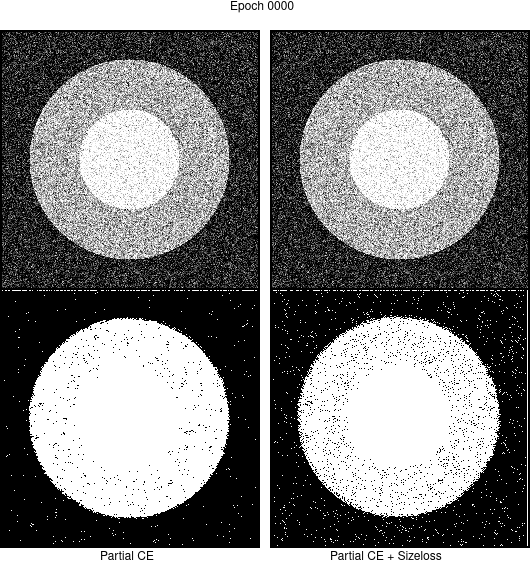

```diff
-Important:
```
## 1- Slides employed during the tutorial will be very soon released (we are waiting for permission from authors to share their images)
## 2- We are working on a survey that will compile all the works on weakly and semi-supervised segmentation with deep models, which will be on arxiv within the next weeks.

# Code demo for the weakly supervised segmentation tutorial at MICCAI 2019



## Requirements
This code was written for Python 3.5+. Most of the required packages include:
```
pytorch (tested with 0.4.0)
torchvision
numpy
scipy
matplotlib
tqdm
PIL
```
`ImageMagick` (available by default on most Linux distributions) is required for the optional script generating the GIF displayed above.

## Usage
The current version is implemented on python 3.5 and pytorch 0.4.0
```bash
python 7-WeaklySup_Segmentation.py --mode 0
python 7-WeaklySup_Segmentation.py --mode 1
python plotResults.py
./gifs.sh
```
For the old version:
```bash
python3 -O 7-WeaklySup_Segmentation.py --mode 0
python3 -O 7-WeaklySup_Segmentation.py --mode 1
python3 plotResults.py
./gifs.sh
```
The `-O` is optionnal, as it is a switch do disable all the assertions and sanity checks within the code.

## Results
Results are stored in the following folder structure:
```
Results/
    Images/
        Results/Images/Weakly_Sup_CE_Loss/
            yy_Ep_xxxx.png
            ...
        Results/Images/Weakly_Sup_CE_Loss_SizePenalty/
            ...
    Statistics/
        Results/Images/Weakly_Sup_CE_Loss/
            CE_Losses.npy
            ...
        Results/Images/Weakly_Sup_CE_Loss_SizePenalty/
            ...
result.gif
```

## Citations
If you are re-using this code as a base, consider citing:

`Kervadec, Hoel, Jose Dolz, Meng Tang, Eric Granger, Yuri Boykov, and Ismail Ben Ayed. "Constrained-CNN losses for weakly supervised segmentation." Medical image analysis 54 (2019): 88-99`.
